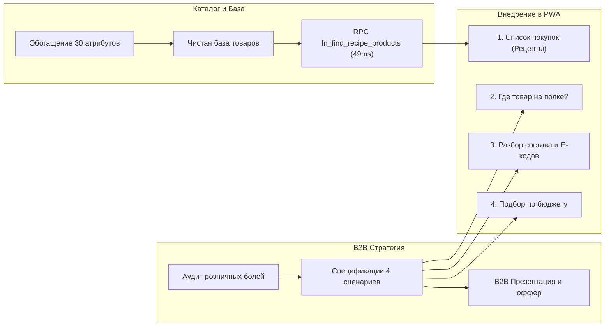

# Аудит Körset AI: B2B2C-стратегия, оцифровка ценности для ритейлеров и спецификация сценариев

> **Статус документа:** Базовый стратегический артефакт (Durable Knowledge)  
> **Дата:** 25 сентября 2026 г.  
> **Область:** Körset AI (`/s/:storeSlug/ai`), B2B2C Retail SaaS в Казахстане

---

## 1. Преамбула и фиксация паузы по сценарию «Собрать список покупок»

### 1.1. Текущий статус сценария №1 (Рецептурная корзина)
- **Что реализовано:**
  - Детерминированный реестр `goldenRecipes.js` (25 классических блюд Казахстана: бургеры, плов, манты, бешбармак, борщ и др.) с категоризацией ингредиентов.
  - Движок самообучения и локального кэширования `recipeRegistry.js`.
  - Мобильный интерфейс: пошаговый мастер (`AIRecipeWizardDock`), горизонтальные карусели товаров со свайпом (`AIRecipeRoleCarousel`), живой подсчет сметы корзины (`AIRecipeSummaryBar`).
  - Механизмы стабильности фронтенда: защитные тайм-ауты (2.5 с), отмена запросов при очистке чата (`AbortController`), центрирование на десктопе (`max-width: 430px`).
  - Все тесты (649 unit-тестов, linter, i18n) полностью пройдены.
- **Причина постановки на паузу:**
  - База товаров супермаркета (`store_products` / `global_products`) в данный момент проходит масштабное фоновое обогащение 30 атрибутами и фотоконтентом.
  - Существующий общий поисковый RPC `fn_search_store_products` перегружен триграммным поиском по всей 50-тысячной базе и упирается в таймауты при поиске ингредиентов.
- **План возврата к сценарию:**
  - Возврат к сценарию произойдет сразу после завершения централизованного обогащения каталога и добавления легковесного узкокатегорийного RPC `fn_find_recipe_products` (выполняющегося за 49 мс). Код законсервирован и готов к активации.

---

## 2. B2B-ценность Körset AI для владельца магазина: Оцифровка пользы и денег

Главная проблема внедрения ИИ в розничной торговле Казахстана: **владельцы супермаркетов скептичны к «чат-ботам»**. Они справедливо считают, что обычный чат-бот — это бесполезная дорогая игрушка, которая не приносит денег в кассу, а только тратит внимание.

Чтобы Körset продавался как B2B SaaS-подписка (15 000 – 45 000 ₸/мес за точку), коммерческое предложение для директора сети (Small, Mars, Dina, Galmart и др.) должно базироваться на **жестких розничных метриках**.

### 2.1. Четыре источника реальных денег для супермаркета

```
┌────────────────────────────────────────────────────────────────────────┐
│                   ФИНАНСОВЫЙ ЭФФЕКТ KÖRSET AI ДЛЯ МАГАЗИНА             │
├──────────────────────────┬─────────────────────────────────────────────┤
│ 1. Спасение брошенных    │ Конверсия покупателей с сомнениями          │
│    товаров (Lost Sales)  │ (аллергии, халал, Е-добавки) в реальный чек │
├──────────────────────────┼─────────────────────────────────────────────┤
│ 2. Рост среднего чека    │ Комплексные сценарии: готовые рецепты,      │
│    (AOV / Basket Size)   │ перекусы и кросс-категорийные связки        │
├──────────────────────────┼─────────────────────────────────────────────┤
│ 3. Экономия ФОТ зала     │ Снятие с продавцов 80% тупых вопросов       │
│    (Labor Optimization)  │ («Где лежит?», «Это халал?», «Сколько стоит»)│
├──────────────────────────┼─────────────────────────────────────────────┤
│ 4. Аналитика упущенного  │ Отчет о товарах, которые искали покупатели, │
│    спроса (Zero-Search)  │ но которых не оказалось на полке            │
└──────────────────────────┴─────────────────────────────────────────────┘
```

#### Источник 1: Спасение потерянной выручки (*Lost Sale Recovery*)
* **Ситуация в зале:** Покупатель (мама ребенка-аллергика, человек с непереносимостью лактозы/глютена или верующий, ищущий халал) берет товар в руки. Состав набран шрифтом 4pt на трех языках, QMDB-значка не видно или маркировка сомнительна.
* **Без Körset:** Человек не рискует здоровьем/принципами, ставит товар обратно на полку и уходит без покупки. Чек потерян навсегда.
* **С Körset AI:** Мгновенный скан или вопрос голосом: «Мне можно при лактазной недостаточности?». ИИ за 1 секунду выдает четкий вердикт: «Лактозы нет, сыворотка не используется, продукт безопасен». Товар отправляется в корзину.
* **Экономика:** Если магазин посещают 1 500 человек в день, из них даже 2% (30 человек) сомневаются в составах. Возврат в корзину 1 товара средней стоимостью 1 200 ₸ дает **+36 000 ₸ выручки в день (+1 080 000 ₸ в месяц)** на одну торговую точку.

#### Источник 2: Увеличение глубины чека через готовые решения (*AOV Boost*)
* Покупатель редко заходит в магазин с готовым идеальным списком. Чаще всего цель: «приготовить что-то на ужин» или «быстро перекусить на работе до 1500 ₸».
* Без ИИ покупатель берет пачку пельменей (1 500 ₸).
* Сценарии Körset AI («Собрать ужин», «Подобрать перекус») собирают сбалансированную корзину из 3–5 товаров из наличия (фарш + спагетти + томаты + пармезан = 4 200 ₸). 
* **Рост среднего чека:** +30–45% на мотивированных сессиях.

#### Источник 3: Разгрузка персонала торгового зала (*Staff Workload*)
* В продуктовом ритейле Казахстана текучка линейного персонала (мерчендайзеры, работники зала) достигает **80–120% в год**. Новички сами не знают ассортимент и расположение рядов.
* Покупатели постоянно отвлекают персонал вопросами: *«Где разрыхлитель?», «Где соевый соус?», «Есть ли халал-колбаса без свинины?»*.
* Körset AI берет на себя роль неутомимого карманного консультанта, освобождая сотрудникам время на приемку, выкладку и контроль сроков годности.

#### Источник 4: Разведка скрытого спроса для закупщика (*Zero-Search Analytics*)
* Кассовая система (1С / Umag / Microinvest) знает только то, что **было куплено**. Она слепа к тому, что покупатели **хотели купить, но не нашли**.
* Модуль аналитики Körset фиксирует ненайденные запросы к ИИ: «За неделю 47 человек искали миндальное молоко Alpro, которого нет в ассортименте».
* Закупщик получает готовое обоснование для расширения матрицы, приносящее дополнительную прибыль.

---

### 2.2. Честная кривая адаптации покупателей (*Adoption Curve*)

Нельзя обещать директору магазина, что завтра 100% бабушек в зале начнут общаться с нейросетью. Честный сценарий внедрения:

1. **Фаза 1 (Месяц 1 — Знакомство):**
   - QR-коды на тележках, полках и плакатах на входе.
   - Активация: 7–12% посетителей открывают сканер. Основной драйвер — сканирование штрихкода (проверка цены и состава).
2. **Фаза 2 (Месяцы 2–3 — Формирование ядра):**
   - 20–25% постоянных покупателей формируют ядро лояльности: мамы с детьми, приверженцы QMDB Halal, спортсмены, диабетики.
   - ИИ становится причиной выбора именно этого магазина перед конкурентом через дорогу.
3. **Фаза 3 (Месяцы 6+ — Полноценный цифровой мерчендайзинг):**
   - Регулярное использование сценариев «Собрать ужин» и «Подобрать по бюджету». Продажи через рекомендации ИИ становятся стабильной статьей дохода точки.

---

## 3. Спецификация трех оставшихся сценариев Körset AI

Вместо шаблонной отправки сухого текста в чат, каждый из трех оставшихся сценариев должен работать как **готовый микро-инструмент с минимальным трением**.

### Сценарий 2: «Найти товар на полке» (*Smart Shelf & Department Finder*)
* **Боль:** Торговый зал супермаркета — это лабиринт. Покупатель не хочет кружить 15 минут в поисках пергаментной бумаги, сухого дрожжевого теста или кокосового молока.
* **Как работает сценарий:**
  1. Тап по сценарию открывает лаконичный док: микрофон для голосового запроса + поле ввода с быстрыми чипсами частых потерь (*«Где приправы?», «Где дрожжи?», «Где соусы?»*).
  2. Ответ ИИ: четкая карточка найденного товара с ценой, статусом наличия и **маршрутным бейджем выкладки**:
     `[Отдел: Бакалея] → [Ряд 3, Средняя полка]`.
  3. Кнопка быстрого действия: «Добавить в список покупок» или «Показать на карте магазина».
* **B2B-выгода:** Ликвидация раздражения покупателей; гарантированная продажа неочевидных и мелких товаров.

### Сценарий 3: «Объяснить состав и Е-добавки» (*Food Detective & Risk Checker*)
* **Боль:** Покупатели боятся «химии» и скрытых компонентов (пальмовое масло, глутамат, диоксид титана, сомнительные эмульгаторы), но не имеют биохимического образования, чтобы читать мелкий шрифт на упаковке.
* **Как работает сценарий:**
  1. Пользователь либо сканирует штрихкод, либо фотографирует блок состава на обороте пачки, либо пишет название.
  2. ИИ раскладывает состав на 3 понятных светофора:
     - 🟢 **Основа и польза:** ключевые натуральные ингредиенты простыми словами.
     - 🟡 **Обратить внимание:** скрытый сахар, соль, калорийность.
     - 🔴/⚪ **Статус безопасности:** проверка по профилю (аллергии, Халал-сертификация QMDB/AHIK, происхождение Е-кодов — животное/растительное/синтетическое).
  3. Резюме в 2 предложениях: *«Состав чистый, эмульгатор Е471 имеет растительное происхождение, халал не нарушен. Подходит для ежедневного употребления»*.
* **B2B-выгода:** Снятие страха перед покупкой новых или более дорогих торговых марок (Private Label сети, премиум-линейки).

### Сценарий 4: «Подобрать по бюджету / Перекус» (*Budget Pick & Smart Bundle*)
* **Боль:** Ограниченная сумма денег (наличные, остаток на Kaspi) или задача «перекусить на ходу / пообедать в офисе за 1500 ₸», не набрав вредного мусора.
* **Как работает сценарий:**
  1. Док с быстрыми пресетами бюджетов и поводов:
     - `[Перекус до 1 000 ₸]`
     - `[Обед в офис до 2 000 ₸]`
     - `[К чаю для гостей до 3 500 ₸]`
  2. ИИ собирает связку из 2–4 сочетающихся товаров из реального наличия (например: сэндвич/выпечка из кулинарии + сок/йогурт + фрукт).
  3. Сумма связки не превышает лимит. Показ общей экономии.
* **B2B-выгода:** Продвижение готовой кулинарии супермаркета и товаров импульсного спроса.

---

## 4. Архитектура и дорожная карта реализации



---

## 5. Выводы и перечень открытых вопросов для совместного решения

Документ зафиксирован в базе знаний проекта. Перед переходом к детальной программной реализации необходимо согласовать с вами ключевые продуктовые развилки:

1. **Вопрос навигации на полке (Сценарий 2):**  
   В базе у нас уже заложены поля `shelf_zone` (отдел/зона) и `shelf_position` (ряд/полка). Насколько магазины в пилотах готовы их заполнять? Имеет ли смысл делать автоматическую привязку к отделам каталога (например, «Бакалея», «Молочный ряд»), если точный номер полки магазин не внес?
2. **Формат сценариев в интерфейсе (Сценарии 3 и 4):**  
   Делаем ли мы их по аналогии со сценарием «Рецептов» — компактный док над полем ввода с чипсами и быстрым вызовом камеры, без загрязнения ленты чата лишними вопросами?
3. **Презентация для B2B:**  
   Какой угол позиционирования для первого магазина в Казахстане вам кажется самым сильным: **«Инструмент удержания покупателей с аллергиями и халал-диетой»** или **«Увеличение среднего чека и разгрузка персонала зала»**?
