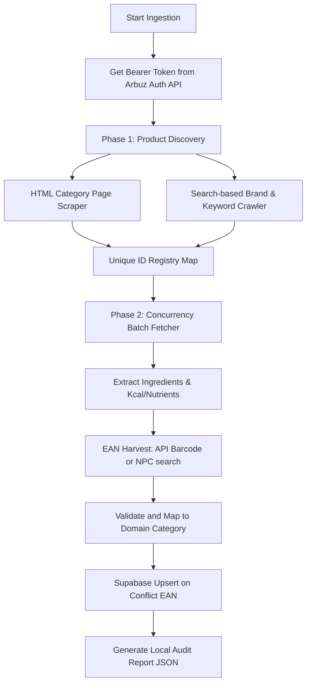

# Arbuz Subcategory Scraping & Database Enrichment Handbook

This document serves as the primary system map, operational handbook, and lessons-learned manual for the B2B retail catalog ingestion system on **Körset**. Use this guide to understand the ingestion architecture, target catalog categories, data enrichment workflows, and best practices.

---

## 1. Core Architecture

The crawler lives in `scripts/arbuz-subcategory-parser.cjs` and is designed as an autonomous, rate-limit-safe ingestion pipeline that populates the canonical `global_products` Supabase database.

### Key Technical Specs
* **Token Extraction**: Dynamically hits `https://arbuz.kz/api/v1/auth/token` with the client credentials `consumer: 'arbuz-kz.web.mobile'` and `key: '20I2OMoyCQ9BGQH7TimHCbErGuEjhLfj'`.
* **Rate Limits & Concurrency**: Uses `CONCURRENCY = 5` and a dynamic pause `DELAY_MS = 250` between details fetches. Do not increase concurrency to avoid IP blocks from retail firewalls.
* **Supabase Client**: Initialized with `persistSession: false` using the service role key to cleanly bypass client caching.

---

## 2. Ingestion Modes & Subcategory Registry

The scraper maintains a strict `MODES` config map that specifies what URLs to scrape and how pages paginate.

| Ingestion Mode (`--mode`) | Target Canonical Category | Target Subcategories | Source Web URLs |
| :--- | :--- | :--- | :--- |
| **`milk`** | `dairy_eggs` | `milk` | `https://arbuz.kz/ru/almaty/catalog/cat/19986-moloko_slivki_sgush_nnoe_moloko` |
| **`juices`** | `water_beverages` | `juice` | `https://arbuz.kz/ru/almaty/catalog/cat/20741-soki_nektary` |
| **`chips`** | `snacks` | `chips` | `https://arbuz.kz/ru/almaty/catalog/cat/225604-chipsy` |
| **`snacks_appetizers`**| `snacks` | `seeds`, `crackers`, `chips`, `fish_snacks` | `https://arbuz.kz/ru/almaty/catalog/cat/225605-zakuski_i_sneki` |
| **`coffee_cocoa`** | `tea_coffee`, `water_beverages` | `coffee`, `lemonade` (for kissel) | `https://arbuz.kz/ru/almaty/catalog/cat/225172-kofe_i_kakao` (plus capsules, beans, kisel, cocoa) |
| **`tea`** | `tea_coffee` | `tea` | `https://arbuz.kz/ru/almaty/catalog/cat/225447-chai` (main parent category containing green, black, herbal) |

---

## 3. Best Practices & Lessons Learned

During the ingestion of the first 2,000 products, we established 4 critical "golden rules" for maximizing catalog density and safety:

### Golden Rule #1: The Scraper + Search Hybrid Model
Scraping raw HTML category pages can be fragile because nested subcategory URLs on Arbuz frequently redirect (301) to new SEO links or return 404. Out-of-stock items are also hidden from categories. 
* **The Best Practice**: Pair page scraping with a **search-based brand/keyword crawl**. By searching popular brands (e.g., `Ahmad`, `Jacobs`, `Lays`) and filtering by `catalogId` or `parentCatalogId`, you find 100% of products including hidden and out-of-stock items, achieving maximum catalog coverage.

### Golden Rule #2: Filter Out Private Label (СТМ) Items
Shoppers use Körset in offline mom-and-pop grocery stores. These offline stores **do not sell competing retail private labels** (such as *Arbuz Select*).
* **The Best Practice**: Filter out all products containing `'Arbuz Select'` or `'Arbuz'` in the brand/title. This keeps the B2B catalog serious, clean, and representative of actual offline store inventories.

### Golden Rule #3: The National Catalog (NPC) GW API EAN Harvest
Over 40% of retail API cards omit product EAN barcodes or store proprietary internal EAN values (e.g., `arbuz_12345`). To make products scannable offline, we must resolve their real EANs.
* **The Best Practice**: When `barcode` is missing, clean the product name (strip grams, volumes, pack sizes) and hit the National Catalog of Kazakhstan API (`https://nationalcatalog.kz/gw/search/api/v1/search`) with `NPC_API_KEY`. If a valid GTIN-13 is found, use it! If not, fallback safely to `arbuz_<id>`.

### Golden Rule #4: Transactional Supabase UPSERT
Multiple categories can share products (e.g., cocoa is found in coffee and snacks). 
* **The Best Practice**: Use Supabase upserts on conflict of the `ean` key. If a product already exists, enrich its missing ingredients/nutrition instead of throwing an error or creating duplicate rows. This guarantees database constraint safety.

---

## 4. Verification and Handback Workflows

Before declaring any subcategory import complete, the following three-step check must be executed:

1. **Verify Database Counts**: Write/run a simple scratch script using Supabase to inspect the specific category distribution (e.g., `scratch/check_coffee.cjs` or `scratch/check_tea.cjs`).
2. **Execute Unit Tests**: Run `npm run check:agent` to ensure that standard nutrition parsers, allergen classification algorithms, and client settings remain 100% healthy.
3. **Inspect Output Audit File**: The crawler outputs a full timestamped JSON log file inside `data/subcategory-import/` detailing every product analyzed, EAN matched, or error skipped. Review this file for debugging anomalies.

---

*Handoff Note for the next AI Agent: The current crawler structure is highly stable. When starting a new category import, simply review `docs/CONTEXT.md` to see which category is next, register the mode in `MODES` inside `scripts/arbuz-subcategory-parser.cjs`, adapt mapping rules, and run the ingestion process.*
