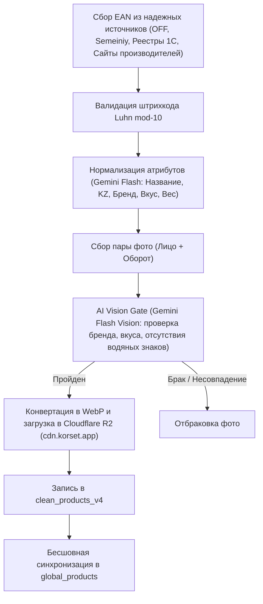

# План генеральной сборки Catalog V4 (Golden Standard)

**Дата:** 2026-09-24  
**Статус:** Согласование архитектуры  
**Цель:** Создание бескомпромиссной базы данных продуктов питания Казахстана (Catalog V4) с нулевой терпимостью к фейковым штрихкодам, пересортице вкусов, водяным знакам и пустым карточкам.

---

## 1. Диагноз проблем V1-V3 (почему сканер на телефоне давал сбои)

1. **Проблема «Товар есть на витрине, но физический штрихкод не находит» (Пример: Корица):**
   - Прошлые парсеры (Arbuz, Korzinavdom) забирали карточки без штрихкодов (в их API штрихкоды скрыты), присваивали внутренние ID (`arbuz_12345`) или искали штрихкод в Национальном каталоге по неточному текстовому названию.
   - В результате на сайте отображалась карточка корицы, но реальный штрихкод с физической пачки к ней не был привязан.
2. **Проблема «Товар находит, но карточка пустая: нет фото, нет состава, имя капсом» (Пример: Сарыагаш):**
   - Штрихкод был загружен из Национального каталога товаров (НКТ).
   - Государственный реестр содержит только штрихкод, БИН завода и юридическое наименование 1C, но не содержит фотографий и текста составов. Товар остался «голым».
3. **Проблема «Популярные товары отсутствуют» (Пример: Knorr, Maggi, приправы):**
   - База V3 формально насчитывала 18 000 позиций, но из них более 7 000 — пустые строки НКТ, а 5 200 — токсичные записи `korzinavdom`. Обычные ходовые товары супермаркетов просто не были оцифрованы.
4. **Проблема «Чужие вкусы и фото белого шоколада на классике» (Пример: Toffifee, MacCoffee):**
   - Эвристика скрипта обогащения подбирала фото по бренду и весу без проверки штрихкода.
   - Старая ошибка склеила штрихкод MacCoffee Original со старым товаром со сгущенкой.

---

## 2. Стандарт качества «Золотой эталон» (Catalog V4 Golden Record)

Товар включается в активную таблицу `clean_products_v4` **ТОЛЬКО при 100% выполнении следующих критериев**:

1. **Подлинный EAN (штрихкод):**
   - Международный формат EAN-13 или EAN-8.
   - Математическая валидация контрольной суммы (Luhn mod-10).
2. **Нормализованное наименование:**
   - Понятное покупателю название на русском и казахском языках.
   - Официальный бренд.
   - Точный вес / объем в стандартных единицах.
   - Точный вкус / наполнитель (или null для классики).
3. **Подлинный состав и КБЖУ:**
   - Текст состава с физической этикетки или подтвержденного ритейл-источника (запрещено генерировать AI-галлюцинации).
   - Энергетическая ценность (ккал, белки, жиры, углеводы на 100 г).
4. **Два чистых изображения на собственном CDN (Cloudflare R2):**
   - Лицевая сторона: `https://cdn.korset.app/products/{ean}/front.webp`
   - Оборотная сторона с составом: `https://cdn.korset.app/products/{ean}/back.webp`
   - Без водяных знаков сторонних магазинов.
   - Проверено через Gemini 3.5 Flash Vision на соответствие бренду и вкусу.

---

## 3. Источники данных для V4

1. **Open Food Facts (HQ CIS / KZ):**
   - Около 3 000–5 000 самых популярных товаров международных брендов (шоколад, напитки, чипсы, соусы, чай/кофе, сухие супы Knorr/Maggi).
   - Имеет проверенные EAN, фронтальные и оборотные фото и составы.
2. **Ритейл-каталоги Казахстана с прямыми EAN-артикулами:**
   - `semeiniy.kz` (артикул товара совпадает с точным EAN-13 штрихкодом);
   - Реестры 1С супермаркетов Казахстана.
3. **Официальные сайты казахстанских производителей:**
   - Рахат, Баян Сулу, FoodMaster, RG Brands, Маслодел / 3 Желания, Султан.

---

## 4. Пайплайн сборки V4

---

## 5. Дорожная карта реализации

- **Этап 1:** Создание миграции для таблицы `clean_products_v4` в Supabase.
- **Этап 2:** Сбор пула эталонных товаров из Open Food Facts и проверенных ритейл-баз по ходовым категориям (напитки, чай/кофе, сладости, снеки, приправы/бакалея, молочка).
- **Этап 3:** Прогон через AI Vision Gate и загрузка пар фото на Cloudflare R2.
- **Этап 4:** Синхронизация в `global_products` и привязка к полкам магазинов без потери цен.
