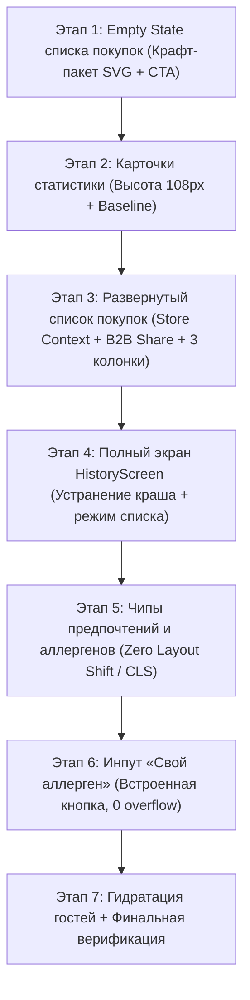

# Поэтапный план и хендофф редизайна ProfileScreen (Профиль, Табы, Список покупок)

> Домен: plans  
> Дата: 2026-09-25  
> Статус: Хендофф для продолжения в новом чате  
> Контекст: Редизайн экрана Профиля, табов статистики, списка покупок, чипов предпочтений и устранение багов  

---

## 1. Фундаментальные принципы и требования владельца проекта

1. **Запрет скорострельности и поверхностности**:
   - Категорически запрещено спешить, отвечать за 30-40 секунд и сразу бросаться писать код на всю задачу.
   - Думать как связка **Senior Software Engineer + Product Marketing Specialist**: каждый элемент интерфейса обязан нести реальную ценность (B2B2C), не перегружать интерфейс визуальным и текстовым шумом.
   - Анализировать лучшие паттерны ведущих продуктов (Kaspi, Wolt, Apple), сравнивать референсы.

2. **Обязательное поэтапное планирование**:
   - Любая объемная задача сначала декомпозируется на понятные, изолированные этапы.
   - Сначала строится общая картина и пошаговый план, задаются ключевые развилки и вопросы для согласования.
   - **Код пишется только после явного подтверждения плана пользователем**, строго шаг за шагом с промежуточной валидацией.

3. **Изоляция параллельных сессий**:
   - В рабочей директории ведутся параллельные работы по каталогу (`CatalogScreen.jsx`, `src/components/catalog/*`, `src/domain/ai/*`).
   - **СТРОГО ЗАПРЕЩЕНО** трогать, откатывать, форматировать или изменять файлы каталога из параллельной сессии.

---

## 2. Общая архитектурная картина задач по ProfileScreen

Задачи разбиты на **7 логических этапов**:

---

## 3. Детальное описание этапов

### Этап 1. Empty State (Пустое состояние) списка покупок
- **Проблема**: В пустом состоянии было слишком много текста, длинный ненужный подзаголовок, отсутствовала прямая конверсионная кнопка перехода в каталог магазина.
- **Требования**:
  1. Векторный авторский крафт-пакет (SVG): стильный, современный, складки, ручки из шнура, эко-листик, деликатные золотистые искры.
  2. Плавная CSS-анимация парения (`craftBagFloat`, `craftBagShadow`, `craftBagSparkle`) с аппаратным ускорением GPU (`will-change: transform`, 120 FPS, 0% CPU/JS нагрузки).
  3. Минималистичный текст:
     - Заголовок: *«В списке пока пусто»* (KZ: *«Тізім әзірге бос»*).
     - Подсказка: *«Сканируйте штрихкоды на полках или добавляйте из каталога»* (KZ: *«Сөрелердегі штрихкодтарды сканерлеңіз немесе каталогтан қосыңыз»*).
  4. Акцентная CTA-кнопка: **«Открыть каталог →»** (KZ: *«Каталогты ашу →»*), ведущая в каталог текущего магазина (`/s/:storeSlug/catalog`).

### Этап 2. Карточки статистики табов (`ProfileStatsTabs`)
- **Проблема**: Карточки были слишком высокими, отнимали полезную площадь экрана, цифры прыгали по высоте из-за разной длины текста (например, 2 строки «Список покупок» vs 1 строка «История»).
- **Требования**:
  1. Компактная высота `.stat-card`: **108px** (на ультраузких смартфонах $\le 360\text{px}$ — **102px**).
  2. Верхняя круглая плашка с иконкой: диаметр **40px** (`top: -16px`).
  3. Цифры статистики: размер **32px** (на узких **28px**), свойство `tabular-nums` для строгой моноширинности.
  4. Блок подписи: строго фиксированная высота **26px** с вертикальным центрированием.
  5. **Результат**: Цифры во всех 3 карточках («Список покупок», «Предпочтения», «История») находятся на строго одинаковой базовой линии (*baseline*) независимо от языка (RU/KZ).

### Этап 3. Развернутый блок списка покупок (Store Context & B2B Viral)
- **Проблема**: Внутри развернутого блока бессмысленно дублировался заголовок «Список покупок (N)», не было привязки к конкретному магазину, не было возможности отправить список семье.
- **Требования**:
  1. Удалить дублирующий заголовок и счетчик.
  2. Статусная строка магазина (Store Context Bar): `📍 [Название магазина] · Цены актуальны` с живым зеленым индикатором.
  3. B2B-виральная кнопка **«Поделиться»**: использует нативный Web Share API в мобильных браузерах с авто-переходом в WhatsApp при отсутствии поддержки. Формирует аккуратный текст:
     *«🛒 Список покупок ([Магазин]):\n1. ...\n2. ...\n\nИтого: ~X ₸\nСоставлено в Körset»*.
  4. Сетка товаров: **3 колонки** на смартфонах (`repeat(3, minmax(0, 1fr))`, gap 8px), вмещающая до 6 товаров (2 ряда по 3).
  5. Удаление в 1 тап: на фото карточки [ProductMiniCard.jsx](file:///c:/projects/korset/src/components/ProductMiniCard.jsx) кнопка `✕` с `e.stopPropagation()`.
  6. Подвал: `Итого в магазине: ~X ₸` + кнопка `Посмотреть все (N) →`.

### Этап 4. Полноценный экран HistoryScreen
- **Проблема**: Белый экран и падение приложения с ошибкой `TypeError: Cannot read properties of null (reading 'length')` при нажатии «Посмотреть все» из-за того, что стейт `history` изначально равен `null`.
- **Требования**:
  1. Устранить ошибку с помощью опциональной цепочки (`history?.length > 0` и `{history?.length || 0}`).
  2. Динамический заголовок экрана: при переходе с вкладки `favorites` шапка меняется на «Список покупок» (KZ: «Сатып алу тізімі»).
  3. Верхняя панель сводки корзины: итоговая стоимость корзины в ₸, количество товаров, кнопка экспорта в WhatsApp.
  4. Цены в строках товаров в тенге (`₸`) и старые зачеркнутые цены при наличии скидок.

### Этап 5. Чипы предпочтений и аллергенов (Zero Layout Shift)
- **Проблема**: При выборе чипа внутрь flex-элемента добавлялась иконка галочки `<svg>`, увеличивая ширину чипа на 16px. В flex-контейнере с `wrap` это приводило к выталкиванию соседних чипов на новую строку — резкий скачок верстки (*Cumulative Layout Shift*).
- **Требования**:
  1. Полностью убрать динамическую вставку галочек.
  2. Минималистичная акцентная заливка (Variant A+):
     - Предпочтения и Халяль: изумрудный фон (`rgba(16, 185, 129, 0.16)`), контур `var(--success-bright)` и мягкое неоновое свечение. Строгая неизменяемая сетка **3×3** для всех 9 диет.
     - Аллергены: рубиновый фон (`rgba(239, 68, 68, 0.16)`), контур `var(--error-bright)` и мягкое свечение.
  3. Размеры чипов, внутренние и внешние отступы остаются на 100% константными при кликах.

### Этап 6. Поле «Свой аллерген» (Защита от переполнения)
- **Проблема**: Кнопка «+ Добавить в список» располагалась в одной flex-строке с инпутом и на экранах $\le 375\text{px}$ вылезала за правый край блока.
- **Требования**:
  1. Кнопка `+` встроена внутрь самого поля ввода справа: `position: absolute; right: 6px; top: 50%; transform: translateY(-50%)`.
  2. Инпуту задан `padding-right: 44px`.
  3. Заголовок карточки: «Свой аллерген» (KZ: «Өз аллергеніңіз»).
  4. Подсказка (placeholder): «Например: клубника, киви...» (KZ: «Мысалы: құлпынай, киви...»).
  5. Физически исключен выход за границы контейнера на экранах шириной вплоть до 320px.

### Этап 7. Гидратация гостей и верификация качества
- **Проблема**: У неавторизованных пользователей (гостей) список покупок в профиле отображался пустым, даже если они сохранили товары в корзину/избранное на полках магазина.
- **Требования**:
  1. Подключить гидратацию товаров из `favoriteEans` для гостей через `hydrateProductsFromFavoriteRows`.
  2. Провести полный цикл верификации:
     - `npm run test:unit` (все 652 теста должны проходить без ошибок).
     - `node scripts/check-i18n.mjs` (все 13 неймспейсов без пропусков в казахской локализации).
     - `npx eslint` (0 ошибок на измененных файлах).
     - `npm run build` (чистая сборка Vite и PWA Service Worker).

---

## 4. Текущий статус кодовой базы и файлов

На текущий момент в ветке подготовлены и собраны следующие изменения:

1. `src/components/profile/ProfileStatsTabs.jsx`:
   - Внедрена векторная иллюстрация крафт-пакета `CraftPaperBagIllustration` и `ShoppingListEmptyState`.
   - Добавлен Store Context Bar (`📍 [Магазин] · Цены актуальны`) и кнопка шеринга корзины.
   - Сетка ограничена 3 колонками и первыми 6 товарами.
   - В подвале блока выведен расчет суммы корзины и кнопка перехода.
2. `src/components/profile/ProfileStatsTabs.css`:
   - Высота карточек `.stat-card` снижена до 108px (моб. 102px), иконка 40px, подпись 26px с выравниванием baseline.
   - Добавлены ключевые кадры анимации крафт-пакета (`craftBagFloat`, `craftBagShadow`, `craftBagSparkle`).
   - Стилизованы новые блоки шапки и подвала списка.
3. `src/components/ProductMiniCard.jsx`:
   - Добавлена кнопка быстрого удаления `✕` на обложке товара.
   - Добавлено отображение цены в тенге (`₸`), скидочной цены, бренда и граммовки.
4. `src/screens/ProfileScreen.jsx`:
   - Подключена гидратация товаров для гостей из `favoriteEans`.
   - Чипы предпочтений переведены на сетку 3×3 с акцентной изумрудной заливкой без сдвига верстки.
   - Чипы аллергенов переведены на акцентную рубиновую заливку без динамических SVG.
   - Инпут своего аллергена переработан: круглая кнопка `+` встроена внутрь поля ввода справа.
5. `src/screens/HistoryScreen.jsx`:
   - Устранено падение при `history === null`.
   - Добавлен динамический заголовок «Список покупок», расчет суммы и шеринг в WhatsApp.
6. `src/locales/{ru,kz}/settings.json`:
   - Добавлены и синхронизированы все необходимые ключи локализации.

---

## 5. Инструкции для следующего агента в новом чате

1. **Не спешить**: Начать с внимательного чтения этого документа (`docs/vault/plans/2026-09-25-profile-screen-redesign-handoff-and-stages.md`).
2. **Проверить текущее состояние**: Просмотреть файлы UI через `view_file` или запустить приложение локально, чтобы оценить визуальный вид.
3. **Обсудить с пользователем**: Если пользователь хочет скорректировать какой-либо этап, сначала утвердить с ним конкретные визуальные или функциональные детали.
4. **Двигаться строго по этапам**: Не пытаться делать всё разом, валидировать результаты на каждом шаге.
5. **Не трогать файлы каталога**: Беречь работу параллельной сессии по экрану каталога.
